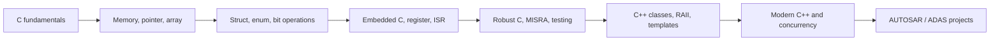

# C/C++ từ cơ bản đến nâng cao cho Automotive Software

Giáo trình tự học C và C++ theo hướng **hiểu bản chất → viết code an toàn → biết dùng ở đâu trong ECU**. Mỗi phần kết nối kiến thức ngôn ngữ với AUTOSAR Classic, MCAL, OS, communication, diagnostics và ADAS.

> Không cần biết C/C++ trước. Hãy đọc tuần tự, tự gõ lại ví dụ, chạy test rồi mới xem đáp án.

## Bản đồ kiến thức



## Các chương

| # | Chương | Liên hệ thực tế |
|---:|---|---|
| 01 | [C căn bản](book/01_c_fundamentals.md) | runnable, state machine, driver logic |
| 02 | [Memory, pointer và array](book/02_memory_pointer_array.md) | buffer CAN/SPI/ADC, memory section |
| 03 | [Struct, enum, bit và modular C](book/03_data_model_modular_c.md) | register, PDU, config object, MCAL API |
| 04 | [Embedded C và concurrency](book/04_embedded_c_concurrency.md) | ISR, OS task, atomicity, DMA |
| 05 | [Robust C, MISRA và testing](book/05_robust_c_misra_testing.md) | safety, review, unit test, coverage |
| 06 | [C++ từ class tới RAII](book/06_cpp_core.md) | resource ownership, middleware, tooling |
| 07 | [Modern C++ nâng cao](book/07_modern_cpp.md) | template, STL, concurrency, ADAS |
| 08 | [AUTOSAR mapping](automotive/01_autosar_mapping.md) | MCAL, OS, COM, DCM, NvM |
| 09 | [ADAS case study](automotive/02_adas_case_study.md) | sensor pipeline và deterministic design |
| 10 | [Bài tập và project](workbook/exercises_and_projects.md) | portfolio + phỏng vấn |

## Lộ trình đề xuất

- Tuần 1–2: chương 01–03, làm toàn bộ bài C nhỏ.
- Tuần 3: chương 04–05, lab ISR/ring buffer/state machine.
- Tuần 4–5: chương 06–07, Modern C++.
- Tuần 6: hai case study Automotive và project cuối khóa.

Mỗi buổi 90 phút: 30 phút lý thuyết, 35 phút code, 15 phút debug/test, 10 phút tự giải thích thành tiếng.

## Build lab

```bash
cmake -S . -B build
cmake --build build
ctest --test-dir build --output-on-failure
```

Yêu cầu compiler hỗ trợ C11 và C++17. GitHub Actions tự build trên mỗi push.

## Quy tắc học và bảo mật

- Ví dụ là code độc lập, không sao chép source thương mại.
- AUTOSAR mapping giải thích kiến trúc; API/config chính xác cần đối chiếu AUTOSAR release và vendor.
- Không dùng dynamic allocation, exception hay STL trong target chỉ vì C++ hỗ trợ; quyết định theo safety, timing, memory và coding guideline của project.
