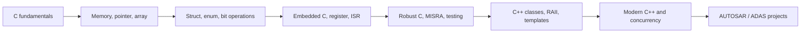

# C/C++ từ zero đến Senior — Embedded, Automotive và Linux

Giáo trình tự học C và C++ theo hướng **hiểu bản chất → viết code an toàn → biết dùng ở đâu trong ECU**. Mỗi phần kết nối kiến thức ngôn ngữ với AUTOSAR Classic, MCAL, OS, communication, diagnostics và ADAS.

> Không cần biết C/C++ trước. Hãy đọc tuần tự, tự gõ lại ví dụ, chạy test rồi mới xem đáp án.

## Bản đồ kiến thức



## Các chương

| # | Chương | Liên hệ thực tế |
|---:|---|---|
| 01 | [C căn bản](book/01_c_fundamentals.md) | runnable, state machine, driver logic |
| 02 | [Memory, pointer và array](book/02_memory_pointer_array.md) | buffer CAN/SPI/ADC, memory section |
| 03 | [Struct, enum, bit và modular C](book/03_data_model_modular_c.md) | register, PDU, config object, MCAL API |
| 04 | [Embedded C và concurrency](book/04_embedded_c_concurrency.md) | ISR, OS task, atomicity, DMA |
| 05 | [Robust C, MISRA và testing](book/05_robust_c_misra_testing.md) | safety, review, unit test, coverage |
| 06 | [C++ từ class tới RAII](book/06_cpp_core.md) | resource ownership, middleware, tooling |
| 07 | [Modern C++ nâng cao](book/07_modern_cpp.md) | template, STL, concurrency, ADAS |
| 08 | [AUTOSAR mapping](automotive/01_autosar_mapping.md) | MCAL, OS, COM, DCM, NvM |
| 09 | [ADAS case study](automotive/02_adas_case_study.md) | sensor pipeline và deterministic design |
| 10 | [Advanced C](senior/01_advanced_c.md) | function pointer, callback, macro, pragma, OOP C |
| 11 | [Toolchain và linker](senior/02_build_toolchain_linker.md) | Make, CMake, ELF, map, linker script |
| 12 | [DSA](senior/03_dsa.md) | complexity, container, algorithm và real-time trade-off |
| 13 | [OOP C++ chuyên sâu](senior/04_cpp_oop_ownership.md) | inheritance, virtual, RAII, smart pointer |
| 14 | [Template và STL](senior/05_templates_stl.md) | generic programming và allocation behavior |
| 15 | [Multithreading](senior/06_multithreading.md) | memory model, atomic, lock, condition variable |
| 16 | [Linux và IPC](senior/07_linux_ipc.md) | process, thread, socket, pipe, shared memory, epoll |
| 17 | [Design patterns](senior/08_design_patterns.md) | patterns phù hợp embedded/ADAS |
| 18 | [Senior engineering](senior/09_senior_engineering.md) | architecture, performance, debugging, review |
| 19 | [AUTOSAR mapping](automotive/01_autosar_mapping.md) | MCAL, OS, COM, DCM, NvM |
| 20 | [ADAS case study](automotive/02_adas_case_study.md) | sensor pipeline và deterministic design |
| 21 | [Bài tập và project](workbook/exercises_and_projects.md) | portfolio + phỏng vấn |

## Final project hoàn chỉnh

[ADAS ECU Reference Platform](final_project/README.md) là project C/C++ tích hợp lớn nhất: AUTOSAR-like C platform, C/C++ ABI, callback, bounded queue, fusion/decision, concurrency, patterns, DEM/NvM lifecycle và integration tests.

## Middle ADAS Vehicle Motion Track

[Chương trình 24 tuần theo JD thị trường](middle_adas/README.md) bổ sung vehicle dynamics, longitudinal/lateral control, ACC/LKA/AEB architecture, gTest–MIL/SIL/HIL, ASPICE, ISO 26262/SOTIF, requirement engineering, estimation và stakeholder delivery.

## AUTOSAR Diagnostic Stack Track

[Khóa DCM–UDS–CanTp thực hành](diagnostic_stack/README.md) đi từ UDS request qua CanIf/CanTp/PduR/DCM DSL–DSD–DSP tới DID/RID callback, DEM/NvM, kèm synthetic variant-coding requirement, ISO-TP lab và negative-response tests.

## Lộ trình đề xuất

- Phase 1 (4 tuần): C nền tảng, pointer/memory, modular C và embedded concurrency.
- Phase 2 (4 tuần): Advanced C, toolchain/linker, MISRA và testing.
- Phase 3 (6 tuần): DSA, OOP C++, ownership, template và STL.
- Phase 4 (5 tuần): multithreading, Linux system programming và IPC.
- Phase 5 (5 tuần): patterns, architecture, performance và Automotive/ADAS projects.

Chi tiết năng lực và tiêu chí senior: [Senior roadmap](senior/00_senior_roadmap.md).

Mỗi buổi 90 phút: 30 phút lý thuyết, 35 phút code, 15 phút debug/test, 10 phút tự giải thích thành tiếng.

## Build lab

```bash
cmake -S . -B build
cmake --build build
ctest --test-dir build --output-on-failure
```

Yêu cầu compiler hỗ trợ C11 và C++17. GitHub Actions tự build trên mỗi push.

## Quy tắc học và bảo mật

- Ví dụ là code độc lập, không sao chép source thương mại.
- AUTOSAR mapping giải thích kiến trúc; API/config chính xác cần đối chiếu AUTOSAR release và vendor.
- Không dùng dynamic allocation, exception hay STL trong target chỉ vì C++ hỗ trợ; quyết định theo safety, timing, memory và coding guideline của project.
