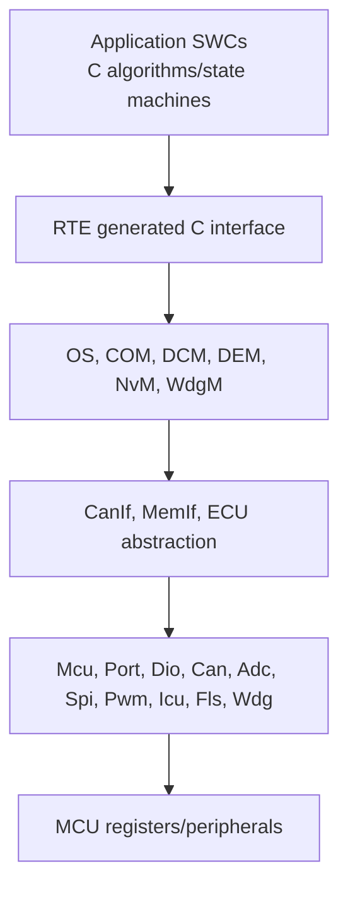
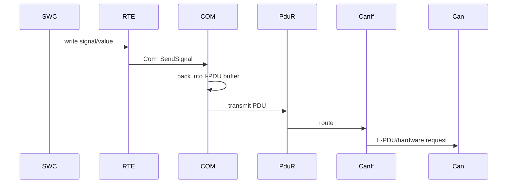

# 08 — C/C++ được dùng ở đâu trong AUTOSAR?



## MCAL

C fixed-width type biểu diễn register/data; mask/shift thao tác bit field; `volatile` truy cập SFR; config `const` struct map symbolic channel tới hardware; ISR/callback báo completion. Các điểm khó là protected sequence, atomic RMW, timeout, clock dependency và derivative-specific errata.

## OS

Function trở thành Task/ISR/Hook entry. Static data và stack phải size theo task/core. Shared variable cần Resource/Spinlock/IOC đúng design. Function reentrancy và priority inversion là vấn đề thật, không chỉ lý thuyết.

## COM stack

CAN payload là byte array; COM pack/unpack signal theo bit position, endian, update bit và transfer property. PduR route PDU bằng configured ID. Không cast payload thành struct vì padding/alignment/endian.



## Diagnostics

DCM service dispatch dùng table/config, state/session/security checks và buffer parsing. DID/RID callback cần validate length/range, handle asynchronous pending và không giữ pointer ngoài lifetime. DEM event processing dùng enum/state/debounce/counter và persistent DTC data qua NvM.

## NvM

Block descriptor là generated config; RAM mirror có lifetime dài; read/write thường asynchronous. C state machine/main function tiến job qua MemIf/Fee/Fls. CRC, redundancy và default data không thay requirement kiểm soát power loss.

## RTE và generated code

RTE cung cấp function/macro/API nối runnable với port. Generated code vẫn là C nên pointer/type/linkage/MemMap quan trọng. Không sửa file generated; sửa model/config/template hoặc manual extension point.

## Classic và Adaptive

Classic chạy trên MCU resource-constrained, phần lớn C, static configuration và hard real-time. Adaptive thường trên MPU/POSIX, service-oriented và C++ phổ biến. Đây là xu hướng kiến trúc, không phải luật rằng Classic cấm C++ hoặc Adaptive không có C.

## Trace một lỗi từ trên xuống

```text
Requirement → SWC/runnable → RTE API → BSW config/state → MCAL API/config → register → bus/pin
```

Ví dụ CAN TX không ra bus: signal value → COM scheduling/I-PDU group → PduR route → CanIf/CanSM mode → Can controller/mailbox → transceiver/pin/clock.
