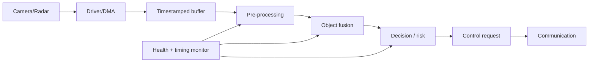

# 09 — ADAS case study: từ sensor frame tới braking request

Đây là mô hình học tập, không phải production safety design.



## Data model

```cpp
struct Object {
    float distance_m;
    float relative_speed_mps;
    std::uint32_t id;
    bool valid;
};

template<std::size_t N>
struct ObjectList {
    std::array<Object, N> objects{};
    std::size_t count{};
    std::uint64_t timestamp_us{};
};
```

Fixed capacity tránh runtime allocation và buộc xử lý overflow policy. `count` phải `<= N`; timestamp cần common time base và wrap/validity design.

## Buffer ownership/zero-copy

Camera frame lớn không nên copy tùy ý. Driver/DMA sở hữu lúc fill; pipeline nhận immutable view; buffer chỉ được recycle sau khi consumer cuối release. Reference-counting tiện nhưng overhead/timing cần đánh giá; pool fixed-size với explicit state thường deterministic hơn.

## Concurrency

Pipeline có thể chạy nhiều core/thread. Mỗi stage nên có bounded queue, deadline, overflow/drop policy và health metric. Queue vô hạn chỉ chuyển lỗi latency thành memory exhaustion.

## Numerical safety

Floating point cần xét NaN/Inf, range, precision và comparison tolerance. Fixed point cần scaling/saturation/overflow. Sensor validity và calibration là một phần input contract.

## Degraded behavior

Nếu camera timeout nhưng radar còn hợp lệ, requirement quyết định degraded feature; code không tự suy ra. Output cần validity/quality/status, không chỉ một torque/brake number.

## C ở đâu, C++ ở đâu?

- C: low-level sensor interface, DMA/interrupt, AUTOSAR Classic BSW/RTE boundary.
- C++: typed object model, algorithm/pipeline, RAII buffer handle, simulation/test tooling.
- Boundary: C-compatible API hoặc serialization; không truyền raw C++ object ABI qua ECU/network.

## Test pyramid

1. Unit test math/state/range.
2. Component test với recorded/synthetic sensor data.
3. SIL kiểm tra software model và timing tương đối.
4. HIL kiểm tra ECU I/O, bus, real-time và fault injection.
5. Vehicle validation kiểm tra intended use trong môi trường thật.

## Interview explanation

> C is still important at the deterministic hardware and AUTOSAR boundary, while C++ helps model ownership and complex ADAS processing. The key is not language preference but bounded memory, explicit lifetime, synchronized timestamps, deterministic scheduling, error propagation and a verified degraded-state strategy.
