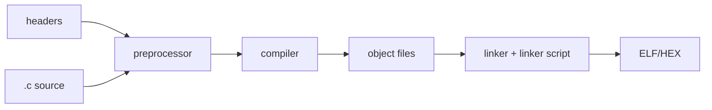

# 01 — C căn bản

## Từ source tới chương trình

Preprocessor xử lý `#include/#define`; compiler biến từng translation unit thành object; linker ghép symbol và đặt code/data vào memory. Header mô tả interface, `.c` giữ implementation.



## Kiểu dữ liệu

Ưu tiên `<stdint.h>` khi width là một phần requirement: `uint8_t`, `sint32_t`/`int32_t`. `unsigned int` không đảm bảo luôn 32-bit trên mọi platform.

```c
uint16_t rpm = 2500u;
int16_t temperature_c = -10;
bool valid = true;
```

Suffix `u` nói literal unsigned. Cẩn thận integer promotion: toán hạng nhỏ hơn `int` thường được promote trước khi tính.

```c
uint16_t a = 60000u;
uint16_t b = 2u;
uint32_t result = (uint32_t)a * (uint32_t)b;
```

Cast trước phép nhân để tránh overflow ở type trung gian trên target có `int` nhỏ.

## Control flow

`if` cho quyết định; `switch` phù hợp state/mode rời rạc; `for` khi biết số lần; `while` khi lặp theo condition. Trong embedded, loop phải có bound hoặc timeout.

```c
typedef enum { INIT, RUN, DEGRADED, SAFE } Mode;

void control_step(Mode mode)
{
    switch (mode) {
    case INIT:     initialize_outputs(); break;
    case RUN:      calculate_control();  break;
    case DEGRADED: limit_output();       break;
    case SAFE:     disable_output();      break;
    default:       report_internal_error(); break;
    }
}
```

Trong AUTOSAR, logic tương tự xuất hiện trong runnable định kỳ, mode handling, MCAL internal state machine và BSW main functions.

## Function và contract

Một function tốt có input/output rõ, side effect giới hạn và precondition được kiểm tra ở đúng boundary.

```c
bool scale_adc(uint16_t raw, uint16_t max_raw, float *out_percent)
{
    if ((out_percent == NULL) || (max_raw == 0u) || (raw > max_raw)) {
        return false;
    }
    *out_percent = 100.0f * (float)raw / (float)max_raw;
    return true;
}
```

Pointer output cho phép trả value cùng status. Trong MCAL/AUTOSAR, `Std_ReturnType` thường báo request/result tổng quát; data đi qua pointer.

## Scope, lifetime và storage duration

- Local automatic: sống trong lần gọi, thường ở stack/register.
- `static` local: sống suốt chương trình nhưng chỉ thấy trong function.
- File-scope `static`: internal linkage, chỉ translation unit đó thấy.
- `extern`: khai báo object được định nghĩa ở nơi khác.

Không đặt global chỉ để “dễ dùng”. Global mutable state tăng coupling và race risk. Module C nên giữ state `static` và cung cấp API kiểm soát.

## Undefined behavior

Ví dụ: signed overflow, dereference pointer invalid, out-of-bounds, shift quá width, dùng variable chưa khởi tạo. Compiler được phép giả định UB không xảy ra, nên bug có thể thay đổi theo optimization.

## Dùng ở đâu trong Automotive?

| Kiến thức | Ví dụ |
|---|---|
| fixed-width type | signal, register field, protocol payload |
| state machine | CanSM, diagnostic session, actuator control |
| bounded loop | driver timeout, polling hardware ready |
| function contract | MCAL API validation, service interface |
| internal linkage | che driver state/config helper |
| defensive default | corrupted mode/state protection |
