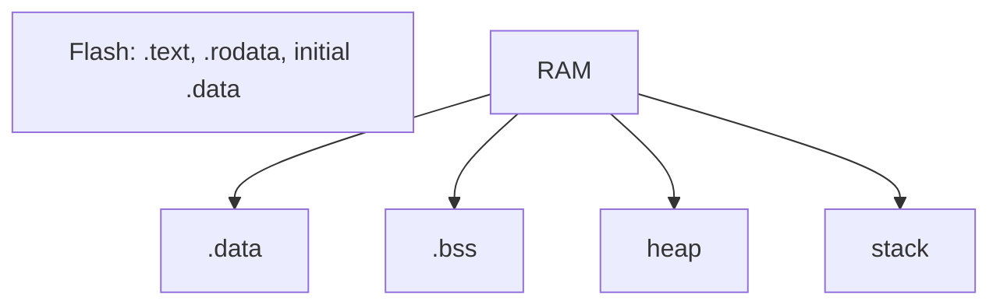
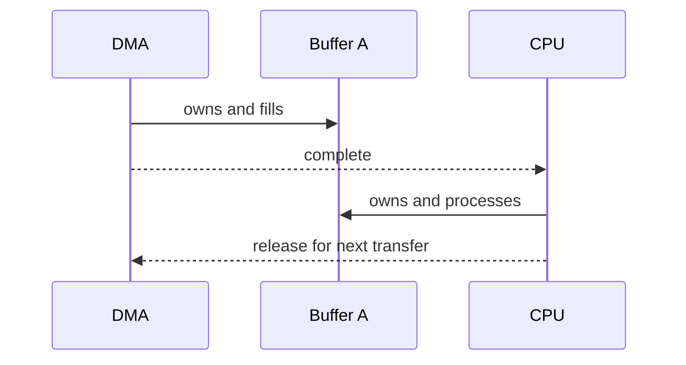

# 02 — Memory, pointer và array

## Memory model

Mỗi object có type, size, alignment, lifetime và địa chỉ. Pointer giữ địa chỉ; dereference truy cập object tại đó.

```c
uint32_t value = 10u;
uint32_t *ptr = &value;
*ptr = 20u;
```

`ptr` không phải `value`; nó chứa địa chỉ của `value`. Pointer type cho compiler biết số byte/cách diễn giải và bước khi pointer arithmetic.

## Array không phải pointer

```c
uint8_t frame[8];
uint8_t *p = frame;
```

Array là object chứa 8 phần tử liên tiếp; `sizeof(frame)` là 8. Pointer là object chứa địa chỉ; `sizeof(p)` là kích thước pointer. Trong phần lớn expression, array “decay” thành pointer tới phần tử đầu, nên dễ nhầm.

Khi truyền array vào function, luôn truyền capacity/length:

```c
bool copy_bytes(uint8_t *dst, size_t dst_size,
                const uint8_t *src, size_t count)
{
    if ((dst == NULL) || (src == NULL) || (count > dst_size)) return false;
    for (size_t i = 0u; i < count; ++i) dst[i] = src[i];
    return true;
}
```

## `const` với pointer

- `const uint8_t *p`: không sửa data qua `p`.
- `uint8_t * const p`: không đổi địa chỉ `p`.
- `const uint8_t * const p`: cả hai.

`const` làm contract rõ và ngăn sửa nhầm; nó không đảm bảo data không bị nơi khác thay đổi.

## Stack, static memory và heap



Safety embedded thường tránh heap runtime vì fragmentation, failure path và timing khó dự đoán. Static allocation dễ phân tích nhưng phải size worst case. Stack cần đo high-water mark và xét nested call/ISR.

## Buffer ownership

Trong CAN/ADC/DMA, câu hỏi quan trọng hơn pointer syntax là: ai sở hữu buffer, ai được ghi, data hợp lệ tới bao giờ?



Nếu DMA và CPU cùng ghi, `volatile` không giải quyết ownership race.

## Function pointer và callback

```c
typedef void (*Notification)(uint8_t channel);

typedef struct {
    uint8_t channel;
    Notification done;
} DriverConfig;
```

AUTOSAR generated config thường chứa callback/function pointer. Driver gọi notification khi interrupt/job hoàn tất. Phải kiểm tra `NULL_PTR`, context (ISR/task) và reentrancy.

## Lỗi thực tế

- trả pointer tới local variable đã hết lifetime;
- dùng `sizeof(pointer)` thay vì buffer size;
- off-by-one (`i <= length`);
- alias/alignment sai khi cast byte buffer thành struct;
- giữ pointer tới COM/driver buffer sau khi ownership đã trả;
- stack overflow do array local lớn.

Không nên cast payload network trực tiếp sang struct vì padding, alignment và endianness. Pack/unpack từng field bằng mask/shift hoặc serialization API.
