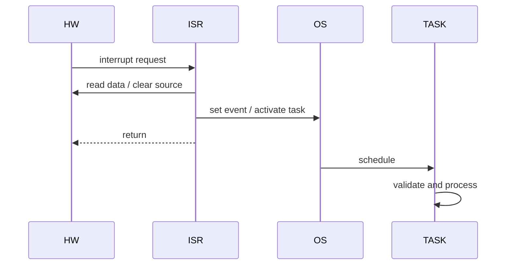

# 04 — Embedded C và concurrency

## Main context, task và ISR

ISR phản ứng nhanh với hardware event; task xử lý dài theo scheduler. ISR nên capture/acknowledge tối thiểu rồi signal task.



## Atomicity

`counter++` là read–modify–write. Dù `counter` là `volatile`, ISR/core khác vẫn có thể xen giữa. Giải pháp: critical section ngắn, OS resource/spinlock, atomic operation hoặc single-writer/message passing.

Không disable interrupt quanh code dài; nó tăng interrupt latency và có thể vi phạm timing.

## Reentrancy

Function reentrant có thể được gọi đồng thời mà không làm hỏng state. Local automatic data thường giúp reentrancy; static mutable state và shared peripheral làm nó khó hơn.

MCAL API thường được phân loại reentrant/non-reentrant. Hai channel khác nhau chưa chắc an toàn nếu cùng controller/register sequence.

## Ring buffer SPSC

Một producer/one consumer ring buffer cần định nghĩa rõ ai cập nhật `head`, ai cập nhật `tail`, full/empty và memory ordering. Trên multicore, chỉ dùng `volatile` vẫn chưa đủ; cần primitive/atomic phù hợp architecture/compiler.

## Timing và timeout

Embedded loop chờ hardware phải có timeout:

```c
bool wait_ready(volatile const uint32_t *status, uint32_t mask,
                uint32_t max_attempts)
{
    while (max_attempts > 0u) {
        if ((*status & mask) != 0u) return true;
        --max_attempts;
    }
    return false;
}
```

Attempt-count chỉ là mô hình; production timeout nên dựa timer nếu execution time thay đổi theo clock/optimization.

## DMA và cache/visibility

DMA là bus master. CPU phải cấu hình buffer/alignment, ownership, transfer count và completion. Nếu core/cache không tự coherent, cần cache maintenance/barrier theo platform. AUTOSAR Dma/MCAL che register nhưng không xóa trách nhiệm về lifetime.

## OS application

| C concept | AUTOSAR OS |
|---|---|
| function | task/ISR entry |
| shared global | shared resource cần bảo vệ |
| callback | alarm hook/error hook/notification |
| critical section | Suspend/Resume hoặc Resource đúng policy |
| state machine | basic/extended task và event flow |
| stack usage | per-task/per-core stack sizing |

Priority inversion xảy ra khi high-priority task chờ resource do low-priority task giữ; OS resource protocol giúp kiểm soát nếu dùng đúng.
