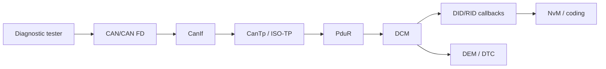

# AUTOSAR Diagnostic Stack — Theory, Configuration and Practice

Khóa học từ CAN frame tới UDS service và application callback, kèm lab DCM/ISO-TP độc lập. Case study dựa trên **workflow** quan sát trong workspace Toshiba MICROSAR, nhưng không sao chép requirement, identifier, generated code hay source thương mại.

## Nội dung

1. [UDS protocol và services](docs/01_uds_protocol.md)
2. [DCM DSL–DSD–DSP](docs/02_dcm_architecture.md)
3. [CanTp/ISO-TP và timers](docs/03_cantp_isotp.md)
4. [End-to-end RX/TX flow](docs/04_full_stack_flow.md)
5. [Toshiba-style requirement/config workflow](docs/05_requirement_to_config.md)
6. [Testing, NRC và debugging](docs/06_testing_debugging.md)
7. [Lab requirement và traceability](docs/07_lab_requirement.md)

## Lab services

- `0x10` DiagnosticSessionControl
- `0x22` ReadDataByIdentifier
- `0x2E` WriteDataByIdentifier
- `0x27` SecurityAccess với seed/key học tập
- `0x31` RoutineControl
- `0x3E` TesterPresent
- ISO-TP SF/FF/CF/FC segmentation/reassembly model

Toy security algorithm không được dùng trong sản phẩm thật.
