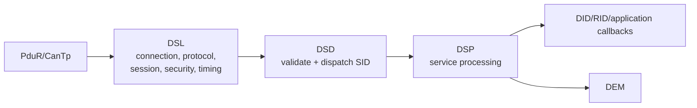

# DCM: DSL, DSD và DSP

## DSL

Diagnostic Session Layer quản lý protocol/connection buffer, request/response, P2/P2* timing, S3 session timeout, session/security state và communication coordination. “Connection” là configured RX/TX diagnostic path/addressing, không phải TCP connection.

## DSD

Diagnostic Service Dispatcher xác định service table, kiểm tra SID/subfunction support và route sang processor. Suppress-positive-response bit thường nằm ở subfunction bit 7 khi service cho phép.

## DSP

Diagnostic Service Processing triển khai behavior 10/22/27/2E/31...; gọi DEM, NvM, application/RTE callback; quản lý synchronous/asynchronous operation và NRC.

## Timing

- P2 server: thời gian normal để ECU bắt đầu/trả response.
- P2*: thời gian mở rộng sau NRC `0x78` responsePending.
- S3 server: nếu tester không giữ session, ECU trở về default.
- Security delay: chống brute-force sau invalid attempts/reset.

DCM main function tiến state machine và timer; callback/application không nên block vượt P2. Operation dài trả pending và được poll lại theo OpStatus pattern trong AUTOSAR implementation.
