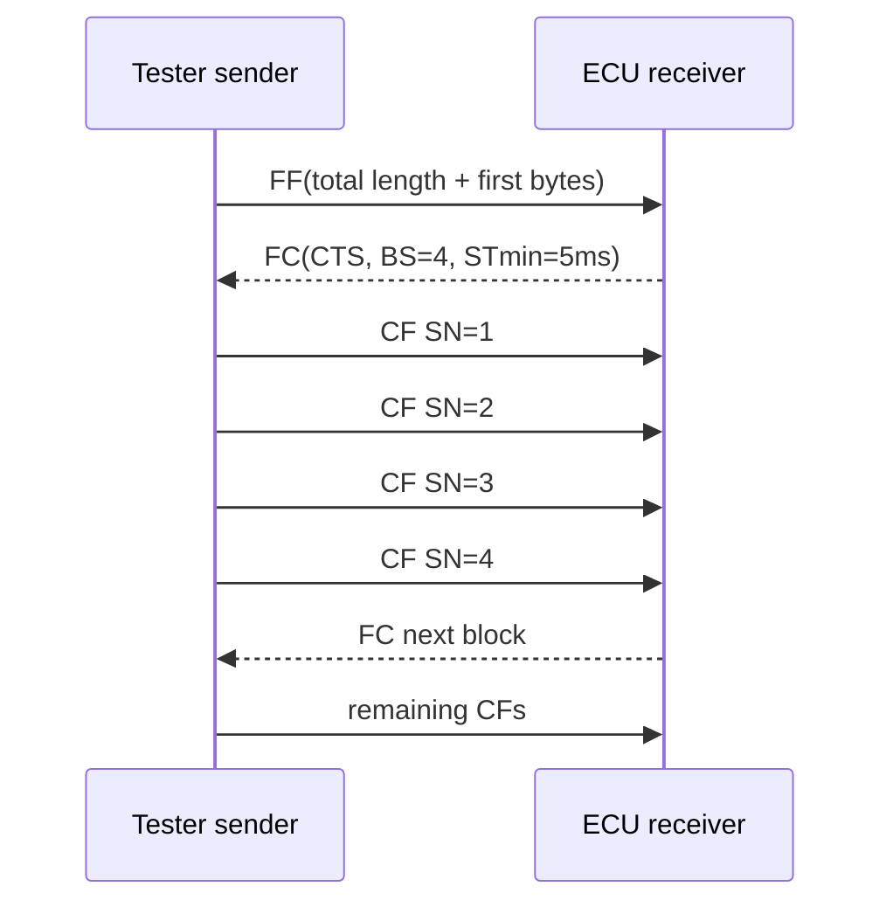

# CanTp / ISO-TP

CanTp segment/reassemble diagnostic N-SDU thành CAN L-PDUs. Nó không hiểu SID/DID.

## Frame types

```text
SF: PCI 0x0L | payload                         (short message)
FF: PCI 0x1L, length low | first payload       (start long message)
CF: PCI 0x2N | next payload                    (N = sequence number)
FC: PCI 0x3S, BS, STmin                        (flow control)
```



BS giới hạn số CF giữa hai FC để receiver kiểm soát buffer/processing. BS=0 thường nghĩa gửi hết không cần FC tiếp. STmin là khoảng cách tối thiểu giữa CF.

Timers thường được gọi N_As/N_Ar, N_Bs/N_Br, N_Cs/N_Cr theo sender/receiver wait point. Timeout hủy channel và báo failure upward; DCM không nhận message partial.

Padding là transport/network configuration. Classic CAN DLC có thể 0–8; CAN FD payload length dùng các giá trị mã hóa lớn hơn. Receiver phải áp rule padding/DLC theo config/spec; không tự xóa byte payload hợp lệ dựa vào giá trị padding.
