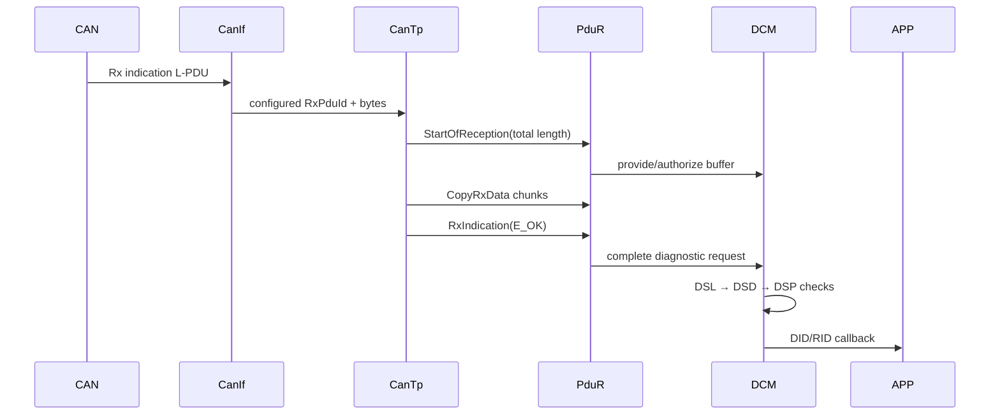
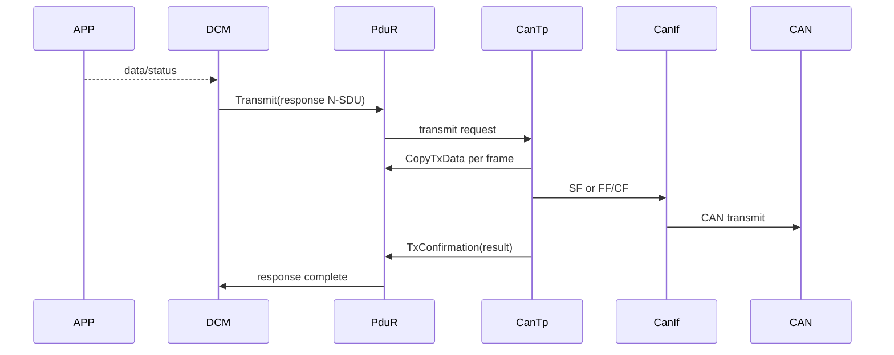

# Full RX và TX flow

## RX request

```mermaid
sequenceDiagram
  participant CAN
  participant CanIf
  participant CanTp
  participant PduR
  participant DCM
  participant APP
  CAN->>CanIf: Rx indication L-PDU
  CanIf->>CanTp: configured RxPduId + bytes
  CanTp->>PduR: StartOfReception(total length)
  PduR->>DCM: provide/authorize buffer
  CanTp->>PduR: CopyRxData chunks
  CanTp->>PduR: RxIndication(E_OK)
  PduR->>DCM: complete diagnostic request
  DCM->>DCM: DSL → DSD → DSP checks
  DCM->>APP: DID/RID callback
```

## TX response

```mermaid
sequenceDiagram
  participant APP
  participant DCM
  participant PduR
  participant CanTp
  participant CanIf
  participant CAN
  APP-->>DCM: data/status
  DCM->>PduR: Transmit(response N-SDU)
  PduR->>CanTp: transmit request
  CanTp->>PduR: CopyTxData per frame
  CanTp->>CanIf: SF or FF/CF
  CanIf->>CAN: CAN transmit
  CanTp->>PduR: TxConfirmation(result)
  PduR->>DCM: response complete
```

PduR route dựa configured PDU IDs; CanIf quyết định upper module bằng Rx/Tx PDU configuration, không phân tích UDS SID để chọn DCM hay CanTp.
