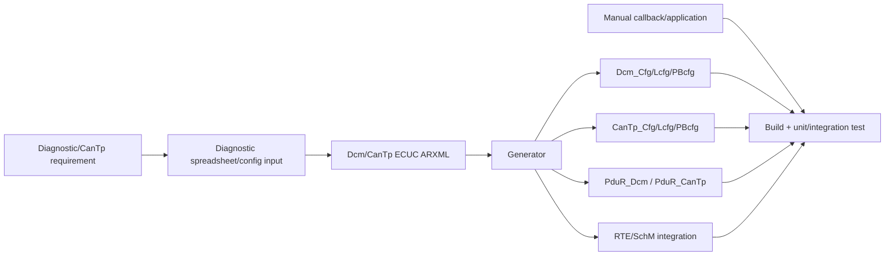

# Toshiba-style workflow: requirement → coding/config → generated artifacts

Workspace cục bộ cho thấy workflow artifact điển hình:



## Synthetic requirement DIAG-COD-001

> ECU shall provide DID `0xF1A0` ConfigurationProfile. Read is allowed in default and extended sessions. Write is allowed only in extended session after security level 1. Data length is 3 bytes: drive-side, powertrain-type, transmission-type. Values outside configured ranges shall be rejected. A successful write shall request persistent storage and update runtime signals after validation.

Requirement này mô phỏng loại variant-coding workflow mà không sử dụng DID/data/symbol thật.

## Breakdown

| Concern | Config/manual artifact |
|---|---|
| DID ID/length | DCM DID/data config |
| read/write ports | callback/RTE client-server config |
| session access | service/DID access config |
| security | DCM security row/level |
| validation | manual callback/domain function |
| persistence | NvM block/config + async job |
| positive/NRC | DCM DSP result mapping |
| test | request matrix session/security/value |

Không sửa generated file để “add DID”. Sửa source configuration/model, regenerate, review diff, implement manual callback và run regression. Generated diff thường lan qua identifiers, tables, access rows, service references và RTE symbols.

## Test sequence

```text
10 03                 enter extended session
27 01                 request seed
27 02 <derived key>   unlock level 1
2E F1 A0 01 02 01     write coding
22 F1 A0              read back
11 01 / simulated reset
22 F1 A0              verify persisted value
```

Production security algorithm/key handling không được public hoặc thay bằng toy XOR.
