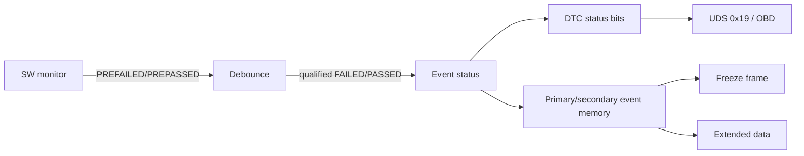

# DEM deep dive — Event, DTC, debounce và memory

DEM quản lý **diagnostic events** bên trong ECU và ánh xạ chúng sang DTC/debuginfo theo configuration. Event không đồng nhất với DTC: nhiều event có thể liên quan một DTC, và event còn phục vụ monitor/status ngay cả khi chưa đủ điều kiện store DTC.

## PREFAILED/PREPASSED và FAILED/PASSED

PRE status đưa sample vào debounce algorithm. Counter/timer đạt threshold mới qualified FAILED/PASSED. FAILED/PASSED đã là kết quả qualified trực tiếp và thường bỏ qua phần pre-debounce tương ứng; cách API/config chính xác phụ thuộc event kind.

Counter debounce tăng khi prefail, giảm khi prepass; có jump-up/jump-down, failed/pass threshold và freeze/reset behavior. Time debounce tích lũy thời gian. Monitor-internal debounce để function tự quyết định qualification.

## Operation cycle

Operation cycle định nghĩa khoảng đánh giá, ví dụ ignition/driving cycle. Cycle start/reset ảnh hưởng `testFailedThisOperationCycle`, pending/confirmed logic, aging và completion. Event availability, enable condition và storage condition là gate khác nhau.

## UDS DTC status byte

Các bit điển hình: testFailed, testFailedThisOperationCycle, pendingDTC, confirmedDTC, testNotCompletedSinceLastClear, testFailedSinceLastClear, testNotCompletedThisOperationCycle, warningIndicatorRequested. Không suy luận confirmed chỉ từ testFailed; confirmation/aging threshold do config.

## Capture và storage

Freeze frame là snapshot signal tại trigger; extended data là counter/trạng thái bổ sung. Capture có thể synchronous hoặc asynchronous. Immediate Nv storage giảm mất dữ liệu khi power loss nhưng tăng write load. Displacement chọn event bị thay khi memory đầy theo priority/occurrence policy.

## Healing và aging

Healing thường điều khiển indicator; aging xóa confirmed DTC sau số operation cycle pass đủ điều kiện. ClearDTC là external service khác. Test cần cover fail → pending → confirmed → heal/age/clear cùng power cycle.

## DEM configuration checklist

Event ID/kind, DTC mapping/format, debounce, operation cycle, enable/storage condition, priority, memory destination, confirmation/aging, indicator, freeze-frame/extended-data class, callback và NvM behavior.

Nguồn chuẩn: [AUTOSAR DEM SWS R20-11](https://www.autosar.org/fileadmin/standards/R20-11/CP/AUTOSAR_SWS_DiagnosticEventManager.pdf).
