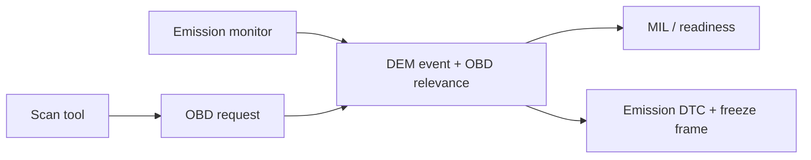

# OBD fundamentals

OBD là legislated diagnostics liên quan emission, khác OEM UDS dù có thể cùng DCM/DEM và CAN/DoIP transport. Terminology/rule phụ thuộc market và applicable regulation/standard version.

## Services/modes khái niệm

OBD modes thường bao gồm current powertrain data, freeze-frame, stored/pending/permanent DTC, clear emission information, oxygen/on-board monitor results, vehicle information và permanent DTC. PID là parameter identifier trong OBD context; DID là UDS data identifier—không dùng lẫn.

## Readiness monitor

Readiness cho biết monitor đã hoàn tất từ clear/power/cycle hay chưa, không đồng nghĩa “không có lỗi”. Driving cycle/enable condition quyết định monitor có cơ hội chạy.

## MIL và permanent DTC

MIL activation/healing tuân confirmation/cycle rule. Permanent DTC không nhất thiết bị xóa ngay bởi clear command; regulation yêu cầu monitor xác nhận sửa chữa theo điều kiện nhất định.

## Configuration questions

DTC format/mapping, OBD relevance, readiness group, MIL indicator, freeze frame, denominator/numerator khi applicable, operation cycle, aging/healing và supported PID/info type.

Không dùng tài liệu này để quyết định homologation; luôn kiểm tra regulation/ISO/SAE áp dụng cho thị trường và chương trình xe.
