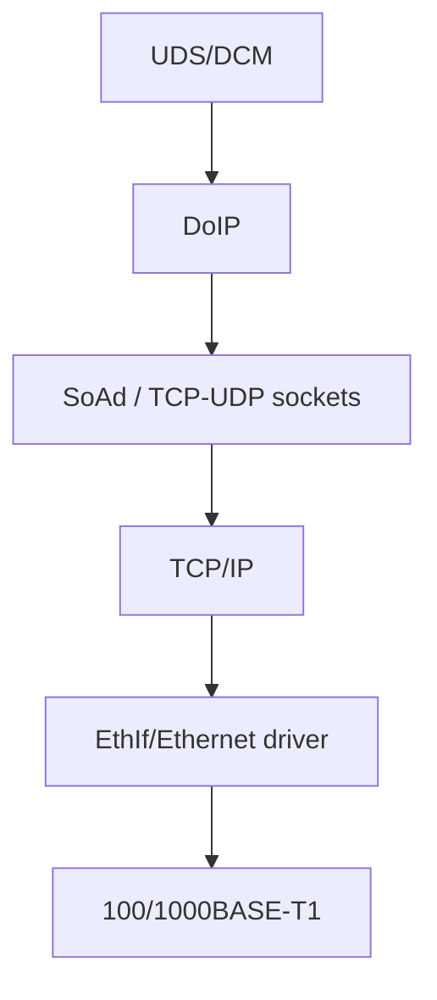

# Automotive Ethernet và Diagnostics over IP

DoIP (ISO 13400) mang diagnostic payload qua IP/Ethernet; UDS service semantics vẫn ở application layer. Băng thông cao hữu ích flashing, centralized/HPC diagnostics và workshop connectivity.

## UDP và TCP roles

UDP port 13400 thường phục vụ vehicle discovery/announcement và một số status request. Diagnostic session payload sau routing activation thường dùng TCP để có ordered reliable stream. TCP reliability không thay application/session timeout hoặc diagnostic access control.

## Generic header

DoIP message có protocol version, inverse version, payload type và payload length, sau đó payload-specific fields. Parser phải validate inverse/version/type/length trước allocation/copy.

## Entity và addressing

Tester/external entity kết nối vehicle announcement/entity hoặc gateway. Logical address định danh diagnostic endpoint khác IP/MAC. Gateway có thể route tới ECU sau vehicle network.

## Routing activation

TCP connect chưa tự cho phép diagnostic. Tester gửi routing activation request; entity kiểm tra activation type, source address, resource/authentication/policy rồi trả response. Alive check giúp quản lý connection/resource.

## Security

Network segmentation/VLAN/firewall, authentication, TLS khi architecture yêu cầu, rate limiting, secure routing activation và diagnostic authorization. DoIP mở attack surface lớn hơn physical CAN access; security concept phải end-to-end.

## DoIP vs CanTp

CanTp segment theo CAN frame, flow control BS/STmin. DoIP dựa TCP/UDP/IP/Ethernet và không dùng ISO-TP FF/CF/FC trên Ethernet path. DCM có thể phục vụ nhiều protocol/connection với priority/preemption configuration.

Nguồn chuẩn: [AUTOSAR DoIP SWS](https://www.autosar.org/fileadmin/standards/R18-10_R4.4.0_R1.5.0/CP/AUTOSAR_SWS_DiagnosticOverIP.pdf).
