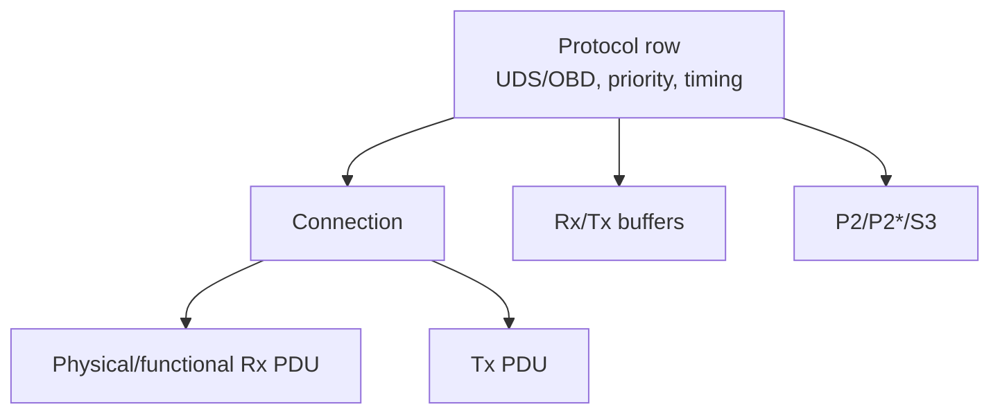

# DCM configuration deep dive

## DSL configuration

Review protocol type/priority/preemption, connection/addressing, main connection, Rx/Tx PDU refs, buffer sizing, timing row, ComM channel, protocol start/stop callbacks và request manufacturer/supplier notification.

Physical request nhắm một ECU; functional request broadcast tới nhóm. Một số service/subfunction không được response theo functional addressing hoặc suppress rule để tránh response storm.

## DSD configuration

Service table gắn protocol với SID entries. Mỗi service có processor, allowed session/security/mode rule, subfunction flag và optional confirmation/indication. Service enabled không có nghĩa mọi DID/RID được phép.

## DSP DID

DID container tham chiếu data elements. Cần identifier, size/fixed-variable length, endianness, data type, read/write/control access, session/security, condition-check/read/write callbacks và port type (synchronous, asynchronous, client-server, function...). Composite DID có nhiều data item và dynamic DID có lifecycle khác.

## DSP routine

RID định nghĩa Start/Stop/RequestResults support, input/output/status record, length, session/security/mode rule và callbacks. Routine dài cần asynchronous state/OpStatus, NRC 0x78 và cancellation behavior.

## Security

Security row có level, seed/key size, delay/attempt policy, seed/key callbacks và persistence behavior. Seed/key demo không phải cryptographic security. Production có thể dùng crypto/authentication scheme khác theo OEM/cybersecurity concept.

## Buffer sizing

Buffer phải chứa request/response N-SDU lớn nhất của protocol path, không chỉ một CAN frame. 4 KiB không phải universal requirement; derive từ max DID/routine/download block và memory budget.

## Generated diff review

Khi add DID/RID, review identifiers, data tables, access refs, callback symbols, RTE port/interface, service table reachability, PDU route nếu connection đổi và build/link symbols. Không chỉnh `Dcm_Lcfg.c`/`Dcm_PBcfg.c` thủ công.

Nguồn chuẩn: [AUTOSAR DCM SWS R24-11](https://www.autosar.org/fileadmin/standards/R24-11/CP/AUTOSAR_CP_SWS_DiagnosticCommunicationManager.pdf).
