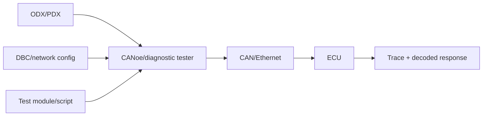

# CANoe, ODX/PDX và diagnostic test workflow

ODX mô tả diagnostic data/service/communication parameters ở dạng máy đọc; PDX là package trao đổi. Tool có thể dùng database để tạo request UI, decode response và sequence, nhưng engineer vẫn phải hiểu raw bytes/NRC/timing.

## Practical workflow

1. Load network/channel and database.
2. Configure tester/ECU address and transport parameters.
3. Import diagnostic description when available.
4. Verify raw request manually for one service.
5. Build session/security precondition sequence.
6. Run positive/negative/boundary/power-cycle cases.
7. Capture bus trace, application log and NvM/DEM evidence with common timestamps.

## Test automation

Data-driven matrix cho session/security/DID/value; reusable unlock/session helpers; explicit expected NRC; wait theo response/timing thay fixed sleep; reset/reconnect handling; report request/response raw bytes và requirement ID.

## XCP relation

XCP dùng measurement/calibration, không phải UDS service. Diagnostic variant write có thể được kiểm chứng qua exposed runtime signal/test interface, nhưng không trộn protocol semantics.

## Gap so với hardware thật

PC lab chưa cover CanIf addressing, real N_As/N_Bs/N_Cr, bus-off, ECU reset/power, EEPROM/Flash time, transceiver và tester interoperability. HIL/CANoe bổ sung các evidence này.
