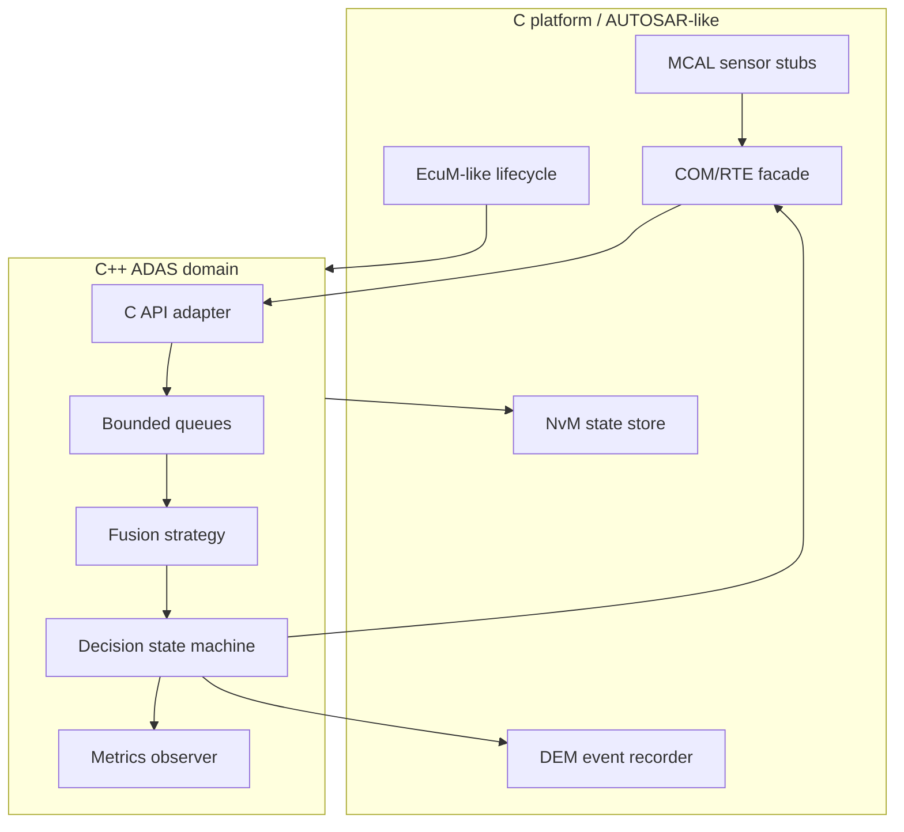

# Final Project — ADAS ECU Reference Platform

Project học tập kết hợp C11 và C++17, lấy cảm hứng từ layering AUTOSAR Classic/Vector MICROSAR trên ECU AURIX nhưng **không chứa source/config Toshiba, Vector hay Infineon**.

Project nay đã có thêm **Vehicle Motion extension**: kinematic bicycle model, ACC-like longitudinal PID/gap control, lateral lane-centering controller, CSV scenario simulation và deterministic tests.

## Use case

ECU nhận radar và camera frame, validate counter/timestamp, fuse object gần nhất, tính cảnh báo va chạm, đóng gói ADAS status để truyền. Nếu sensor timeout hoặc corrupt, feature chuyển degraded/fault; DEM-like layer ghi event. Khi shutdown, pipeline drain và NvM-like state được commit trước khi OFF.



## Mapping

| Reference component | AUTOSAR/MICROSAR concept |
|---|---|
| `platform_c` | MCAL/COM/DEM/NvM/EcuM façade |
| C callback table | generated configuration/callout |
| `CPlatformAdapter` | RTE/complex-driver boundary |
| `BoundedQueue` | OS task/event/IOC-like handoff |
| `FixedObjectPool` | deterministic memory strategy |
| `FusionStrategy` | Strategy pattern/algorithm variant |
| `AdasController` | SWC runnable/state machine |
| worker threads | PC/Linux simulation of scheduled tasks |

## Kiến thức được thực hành

C function pointer/callback, opaque state, fixed-width types, bit packing, C/C++ ABI; RAII, smart pointer, move, templates, STL algorithms; bounded DSA, mutex/condition variable/atomic, lifecycle/cancellation; Strategy/Observer/Adapter/State; Linux/PC build, CMake, tests, sanitizers và observability.

## Build/run

```bash
cmake -S . -B build
cmake --build build
ctest --test-dir build --output-on-failure
./build/adas_ecu_demo
./build/adas_motion_sim > motion.csv
```

## Safety disclaimer

Đây là simulator để học. Không dùng trực tiếp để điều khiển phanh/xe thật. Production cần system/safety requirements, qualified stack/toolchain, timing analysis, E2E protection, calibration, vehicle validation và safety case.

## Thứ tự đọc source

1. `include/platform_c.h` và `src_c/platform_c.c`: C boundary.
2. `include/adas_types.hpp`: domain model.
3. `include/bounded_queue.hpp`: DSA và concurrency invariant.
4. `include/platform_adapter.hpp`: callback/Adapter/C ABI.
5. `include/fusion.hpp`: Strategy và algorithm.
6. `src_cpp/adas_controller.cpp`: worker lifecycle và output.
7. `src_cpp/ipc_publisher.cpp`: Linux IPC/RAII.
8. `tests/test_project.cpp`: expected behavior.
9. `docs/requirements_and_traceability.md` và `docs/knowledge_coverage.md`.

## Giáo trình có hình minh họa

- [Project Study Guide: giải thích toàn bộ flow](docs/01_project_study_guide.md)
- [Debugging và bài tập mở rộng](docs/02_debugging_and_exercises.md)
- [Đánh giá mức sẵn sàng Junior ADAS](docs/03_junior_adas_readiness.md)
