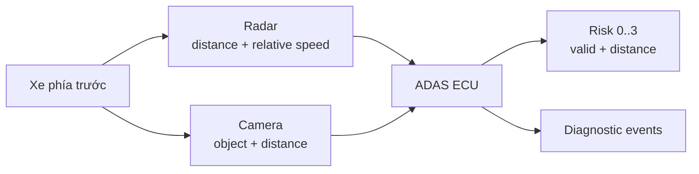
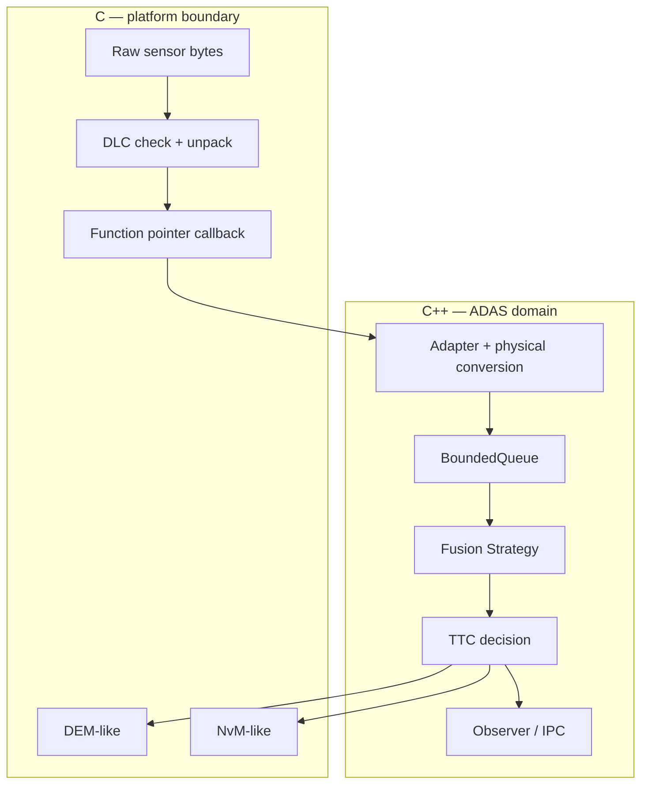
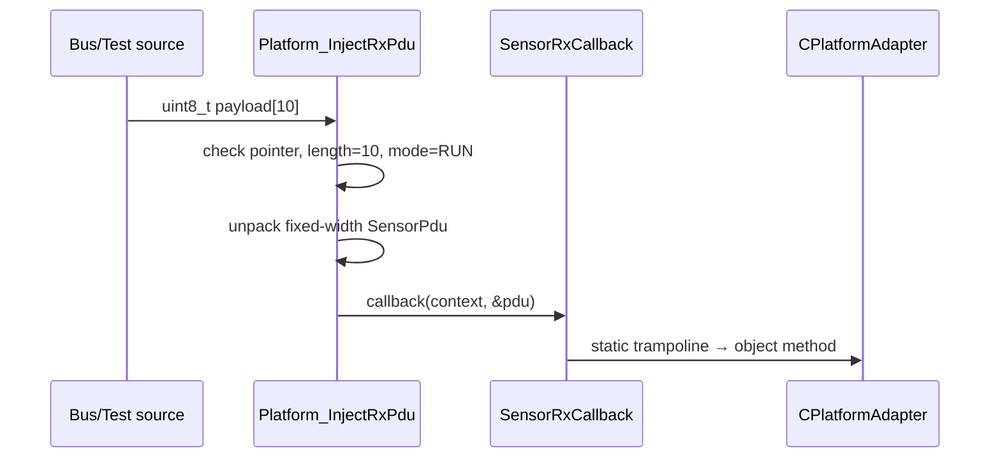
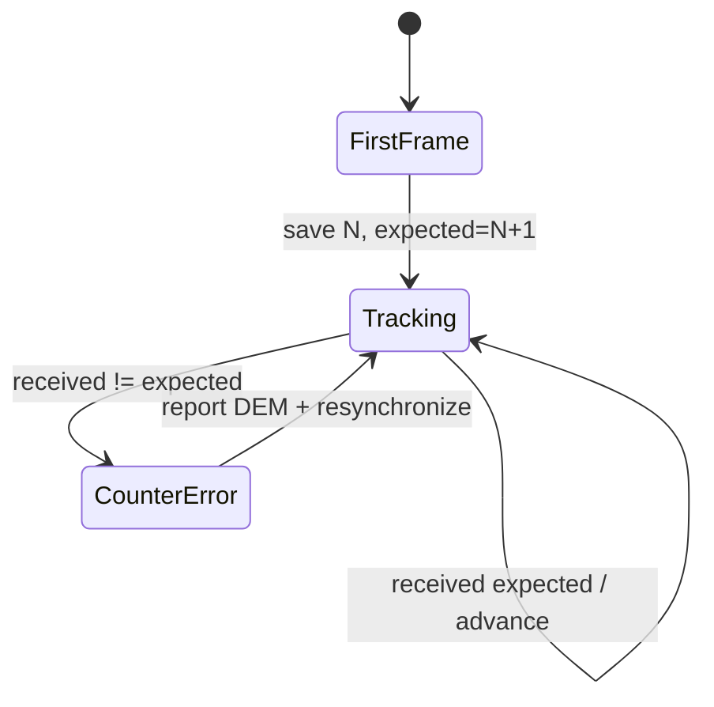
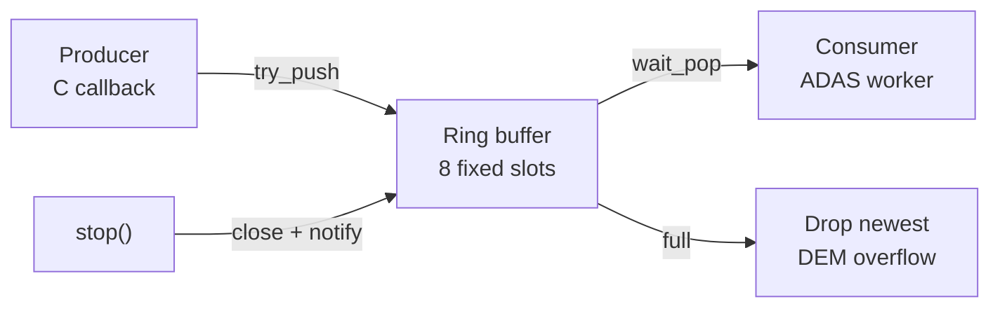
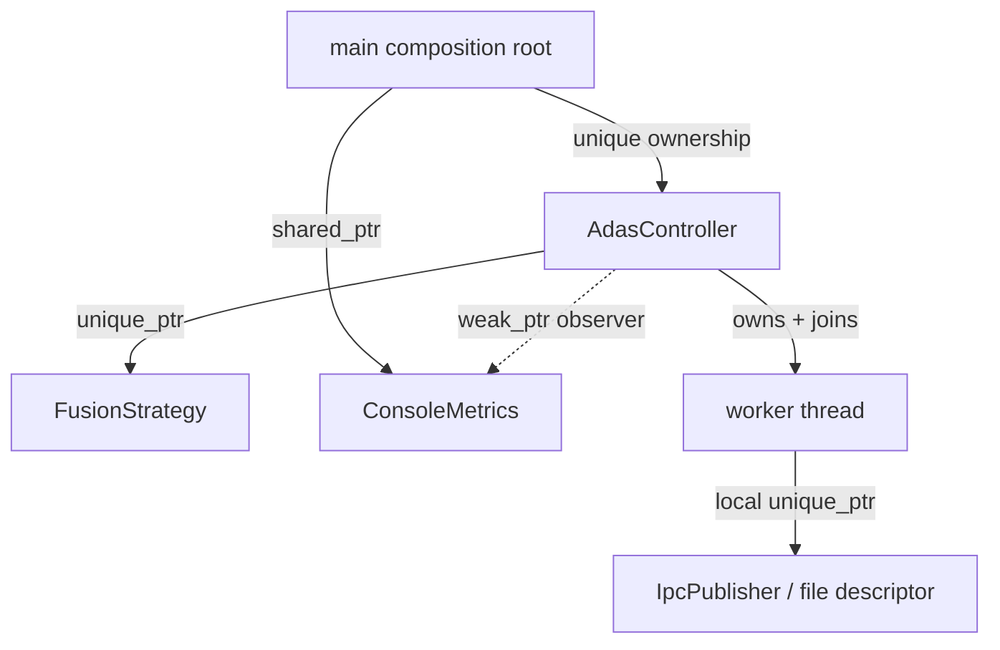
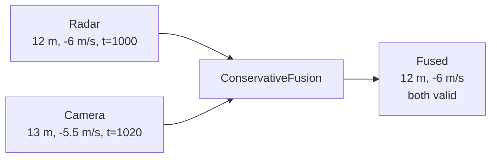
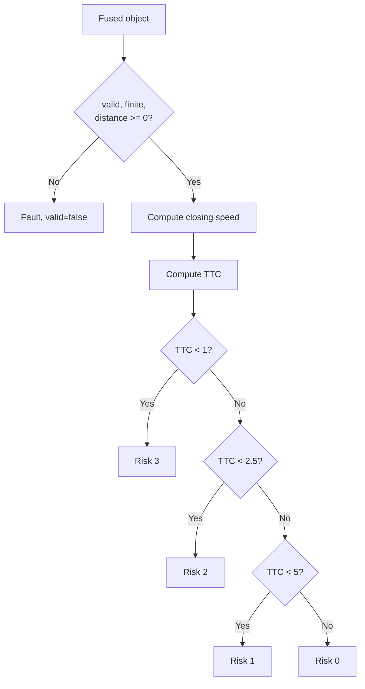
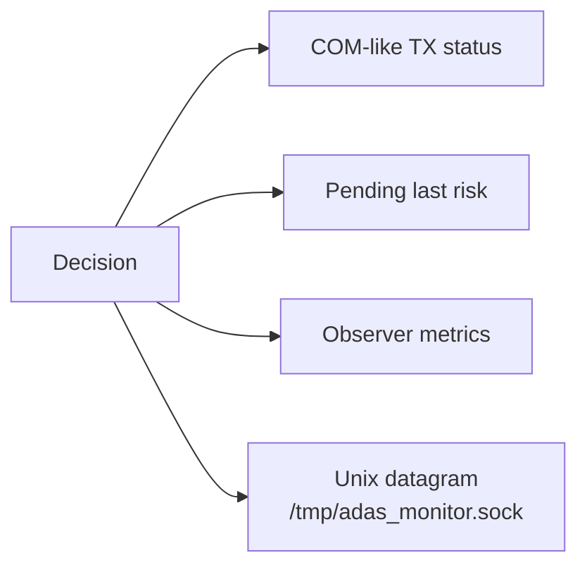
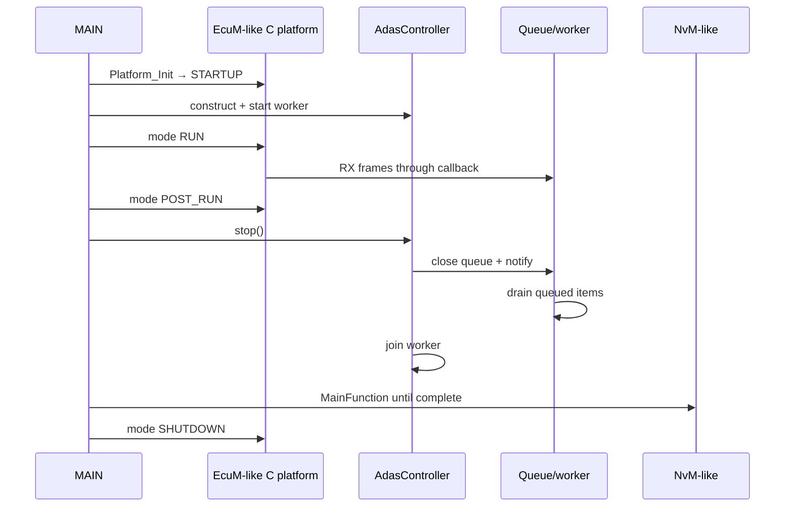

# Project Study Guide — học project từ số 0

## 1. Project đang mô phỏng điều gì?

Một xe có radar và camera cùng quan sát vật thể phía trước. Radar đo khoảng cách/tốc độ tương đối tốt; camera xác nhận vật thể và hỗ trợ phân loại. ECU nhận hai nguồn, kiểm tra dữ liệu, hợp nhất chúng, tính mức rủi ro rồi phát trạng thái ADAS.



Project không thực hiện computer vision thật. Nó tập trung vào software architecture bao quanh algorithm: data format, ownership, scheduling, error handling, shutdown và test.

## 2. Vì sao vừa C vừa C++?



C boundary tương tự nơi MCAL/BSW/generated interface thường xuất hiện trong AUTOSAR Classic. C++ domain giúp diễn đạt ownership, interface, algorithm strategy, threading và RAII rõ hơn. `extern "C"` giữ linkage tương thích, không biến C++ thành C.

## 3. Raw PDU được unpack thế nào?

Project dùng PDU học tập dài đúng 10 byte:

```text
Byte:   0         1         2..3          4..5             6..9
      +---------+---------+-------------+----------------+--------------+
      |Sensor ID| Counter |Distance [cm]|Rel speed [cm/s]|Timestamp [ms]|
      +---------+---------+-------------+----------------+--------------+
Size:    1 B       1 B         2 B             2 B              4 B
```

Các field nhiều byte dùng little-endian trong simulator. `platform_c.c` đọc từng byte bằng shift/or thay vì cast payload thành struct. Cast trực tiếp có thể sai vì alignment, padding và endian.



## 4. Function pointer nối C với object C++

C không biết class hay `this`. Khi đăng ký callback, C++ truyền hai thứ:

- địa chỉ function `rx_callback` có C-compatible signature;
- `void *context` trỏ tới object `CPlatformAdapter`.

Khi có PDU, static callback cast context về object và gọi `on_rx`. Pattern này xuất hiện ở driver callback, RTOS callback, C library và hardware abstraction.

```text
C storage: [callback address] [context address]
                    │              │
                    └──── call ────┘
                              ↓
          CPlatformAdapter::rx_callback(context, pdu)
                              ↓ cast
                     adapter->on_rx(*pdu)
```

Context phải sống lâu hơn thời gian callback có thể xảy ra. Project giữ adapter trong `main()` tới sau khi controller dừng.

## 5. Counter validation

Mỗi sensor có counter riêng. Sau frame counter `N`, frame hợp lệ tiếp theo mong đợi `N+1` theo modulo `uint8_t`. Nếu nhảy từ 0 sang 2, adapter báo `EVENT_BAD_COUNTER`.



Production E2E/rolling-counter behavior phải theo specification: window, duplicate, wrap, timeout, debounce và recovery. Demo chỉ minh họa invariant cơ bản.

## 6. Bounded queue và backpressure

Callback không chạy fusion trực tiếp. Nó đưa `Detection` vào queue capacity 8; worker thread lấy ra xử lý.



Queue fixed-size làm memory bound rõ. Khi full, policy hiện tại là drop frame mới và tăng event counter. Production phải chọn policy theo requirement: drop-oldest, drop-newest, block, coalesce hoặc chuyển degraded.

`condition_variable` cho worker ngủ khi queue rỗng. Predicate `closed || size != 0` chống spurious wakeup. Mutex bảo vệ đồng thời head, tail, size và slot ownership.

## 7. Ownership và lifetime



- `unique_ptr<FusionStrategy>`: controller là owner duy nhất.
- `shared_ptr<Observer>`: composition root giữ observer sống.
- `weak_ptr`: controller quan sát nhưng không tạo ownership cycle.
- destructor controller gọi `stop()`, bảo đảm join thread.
- Unix publisher destructor đóng file descriptor theo RAII.

Smart pointer không thay design; sơ đồ ownership phải được quyết định trước khi chọn pointer.

## 8. Fusion Strategy

Radar và camera được lưu thành hai snapshot mới nhất. Khi đã có cả hai, `ConservativeFusion`:

1. kiểm tra chênh timestamp không quá 50 ms;
2. chọn khoảng cách nhỏ hơn để thận trọng;
3. chọn relative speed âm hơn;
4. đánh dấu radar valid và camera valid nếu synchronized.



Strategy interface cho phép thay algorithm khác mà controller không đổi. Production cần association/object lists, uncertainty, calibration, coordinate transform và temporal filtering phức tạp hơn nhiều.

## 9. TTC và risk

Time To Collision đơn giản:

```text
closing_speed = max(-relative_speed, 0)
TTC = distance / closing_speed
```

| TTC | Risk |
|---:|---:|
| `< 1.0 s` | 3 — critical |
| `< 2.5 s` | 2 — high |
| `< 5.0 s` | 1 — warning |
| otherwise | 0 |



TTC demo không đủ để điều khiển phanh. Nó thiếu ego speed, acceleration, road curvature, object confidence, driver state và safety validation.

## 10. Output, DEM, NvM và IPC

Sau decision, worker thực hiện bốn output độc lập:



IPC dùng datagram non-blocking để monitoring không chặn control pipeline. Nếu không có receiver, `publish()` fail nhưng decision vẫn tiếp tục. Đây là graceful degradation cho optional observer; production cần counter/log rate-limit.

## 11. Lifecycle và shutdown đúng



Nếu hủy object trước khi join, worker có thể truy cập memory đã chết. Nếu shutdown trước NvM completion, last risk không được persist. Hai lỗi này minh họa vì sao lifecycle quan trọng như algorithm.

## 12. AUTOSAR/MICROSAR mapping

| Project | Hệ thống thật tương ứng gần nhất |
|---|---|
| `Platform_InjectRxPdu` | Can/CanIf/PduR/COM RX path hoặc sensor CDD |
| callback | COM notification/RTE/complex driver callout |
| `CPlatformAdapter` | SWC/RTE adapter hoặc integration layer |
| worker + queue | OS task/event/IOC; không nhất thiết `std::thread` |
| `Platform_DemReport` | DEM event report/debounce configuration |
| `Platform_NvM*` | NvM asynchronous block service/main functions |
| `Platform_ComSendAdasStatus` | COM signal packing/I-PDU scheduling |
| Unix IPC | Linux/Adaptive/service monitoring; không phải Classic MCAL |

Trong Toshiba MICROSAR, tên module/config/API vendor có thể khác. Học mapping theo trách nhiệm, rồi trace source/config thực tế; không giả định simulator là generated code thật.
