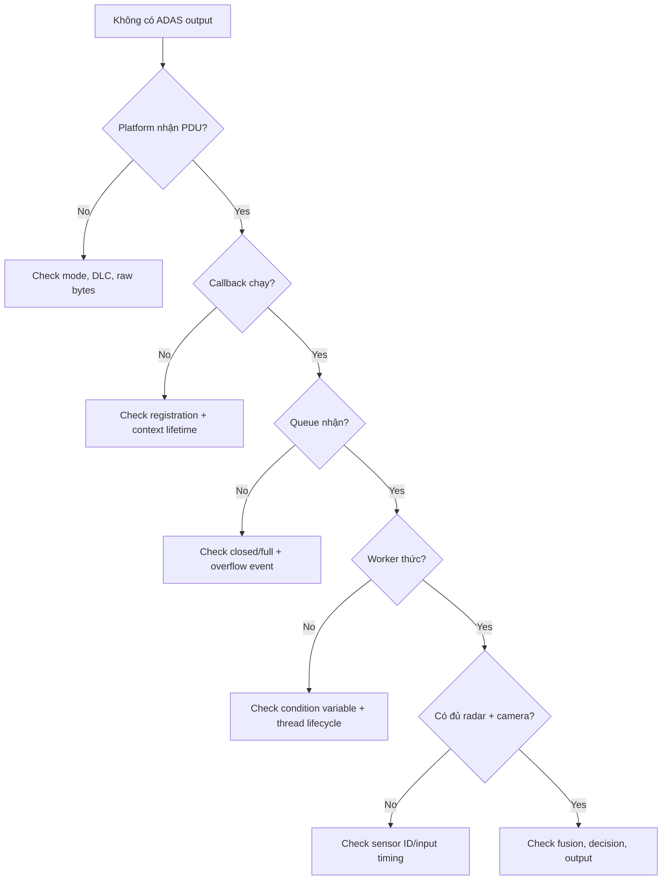

# Debugging guide và bài tập mở rộng

## Debug theo tầng

## Failure-injection exercises

1. Gửi payload 9 byte và xác nhận không callback.
2. Gửi frame khi `ECU_POST_RUN` và xác nhận bị reject.
3. Gửi counter `0, 2` và kiểm tra DEM counter.
4. Producer nhanh hơn worker để làm đầy queue.
5. Camera timestamp lệch radar hơn 50 ms và quan sát `Degraded`.
6. Cho distance `NaN` trực tiếp vào `decide()` và xác nhận `Fault`.
7. Không có Unix socket receiver và xác nhận pipeline vẫn chạy.
8. Gọi `stop()` hai lần và xác nhận idempotent/no crash.

## Bài nâng cấp theo level

### Junior

- thêm sensor timeout dựa `steady_clock`;
- thêm unit test cho boundary TTC;
- thêm CRC8 cho raw PDU;
- tách TX payload packer và test endian;
- thêm log enum state dễ đọc.

### Middle

- thay latest-pair bằng timestamp synchronization buffer;
- thêm fixed object pool và zero-copy handle;
- implement explicit state machine có entry/exit/timeout;
- thêm DBC-like generated config table;
- đo queue latency và high-water mark.

### Senior

- abstraction scheduler để cùng domain chạy trên `std::thread` hoặc AUTOSAR OS;
- E2E protection profile-like counter/CRC/data ID;
- lock-free SPSC variant và proof/benchmark so với mutex queue;
- multi-process shared-memory transport có version/commit marker;
- fault containment, watchdog checkpoints, WCET/memory budget;
- requirement → architecture → safety mechanism → verification trace.

## Review checklist

- Ai sở hữu object/buffer tại mỗi mũi tên?
- Callback chạy ở context nào và có block không?
- Queue full/closed thì hành vi gì?
- Shared state nào được mutex/atomic bảo vệ?
- Shutdown có ngăn producer, drain, join rồi persist đúng thứ tự?
- External data đã kiểm tra pointer, length, range, endian và freshness chưa?
- Error nào là return code, metric, DEM event hay safety reaction?
- Test có normal, boundary, invalid, timeout, overload và shutdown không?
