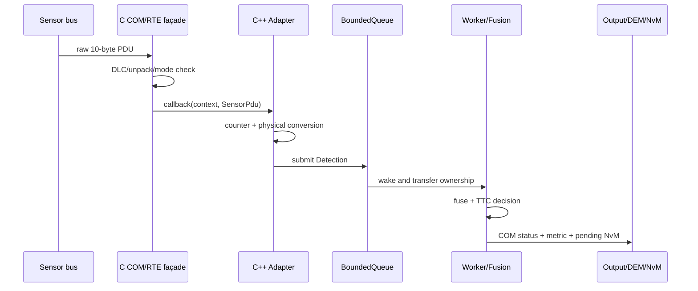

# Requirements, architecture decisions và traceability

## Requirements

| ID | Requirement | Verification |
|---|---|---|
| ADAS-F-001 | Nhận radar/camera PDU 10 byte chỉ ở RUN | platform unit/integration test |
| ADAS-F-002 | Convert cm/cms sang SI và giữ timestamp/counter | adapter test/review |
| ADAS-F-003 | Fuse synchronized inputs và tính TTC risk 0–3 | fusion unit test |
| ADAS-F-004 | Counter discontinuity tạo DEM-like failure | integration test |
| ADAS-F-005 | Queue full không allocate thêm, report overflow | stress test extension |
| ADAS-F-006 | Shutdown join worker và persist last risk | lifecycle test |
| ADAS-NF-001 | Runtime pipeline không dynamic allocate sau startup | design + allocation instrumentation |
| ADAS-NF-002 | Không copy controller; ownership explicit | compile-time API review |
| ADAS-NF-003 | C ABI là boundary giữa platform/domain | build/link test |

## Architecture decisions

### ADR-001 — C platform, C++ domain

C phù hợp MCAL/BSW-compatible interface và generated configuration. C++ phù hợp ownership, concurrency và algorithm composition. Boundary chỉ dùng POD/fixed-width types và `extern "C"`.

### ADR-002 — Bounded queue

Fixed-capacity queue giới hạn memory. Policy hiện tại drop-new + DEM counter; production policy phải lấy từ safety/timing requirement.

### ADR-003 — One worker

Một worker giữ fusion state, tránh lock giữa radar/camera state. Scale-up nhiều worker cần partition/ordering design mới, không chỉ tăng thread count.

### ADR-004 — Observer weak ownership

Controller không kéo dài lifetime observer; `weak_ptr` tránh ownership cycle. Metrics object do composition root sở hữu.

## Sequence

## Những phần cần mở rộng để đạt production-like

CRC/E2E profile, sensor timeout clock, OS abstraction thay raw thread, multi-rate scheduling, calibration/NvM blocks, DBC-generated pack/unpack, proper DEM debounce, Linux IPC transport, object pool cho raw frames, WCET/load test và fault injection.
