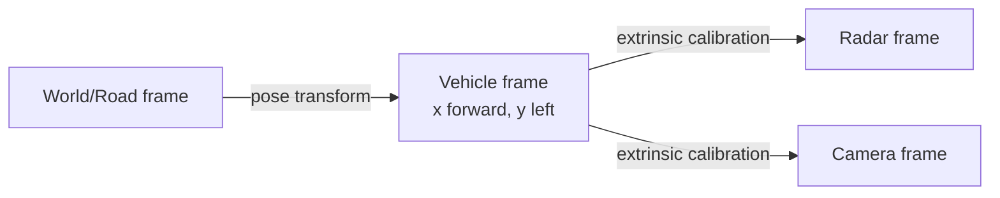
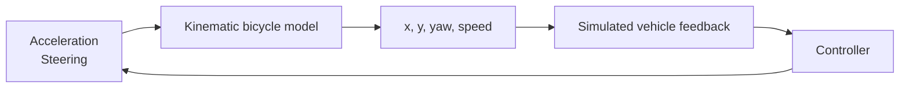

# Vehicle dynamics từ căn bản

## Coordinate frame

Vehicle frame thường dùng trục x hướng trước, y sang trái, z lên trên; sign convention phải được ghi trong interface. World/road/sensor frames cần transform rõ.



## Longitudinal quantities

- position `x` [m], speed `v` [m/s], acceleration `a` [m/s²], jerk `j = da/dt` [m/s³];
- stopping distance gồm reaction distance và braking distance;
- relative distance/gap và relative speed quyết định car-following risk;
- comfort yêu cầu giới hạn acceleration/jerk, không chỉ đạt target speed.

Discrete integration đơn giản:

```text
v[k+1] = max(0, v[k] + a[k]·dt)
x[k+1] = x[k] + v[k+1]·dt
```

## Lateral quantities

Yaw là hướng xe, yaw rate là tốc độ quay quanh z, lateral error là khoảng cách tới path, heading error là chênh hướng xe/path. Steering angle tạo curvature.

Kinematic bicycle model gộp hai bánh trước/sau:

```text
yaw_rate = v / wheelbase · tan(steering)
yaw[k+1] = yaw[k] + yaw_rate·dt
x[k+1] = x[k] + v·cos(yaw)·dt
y[k+1] = y[k] + v·sin(yaw)·dt
```



Model kinematic phù hợp tốc độ/condition đơn giản. Middle engineer phải biết giới hạn: không mô hình tire slip, load transfer, actuator lag, road friction hay nonlinear tire force. Dynamic bicycle/Pacejka cần cho bài toán sâu hơn.

## Sampling

Control chạy discrete time. `dt` sai hoặc jitter lớn làm gain behavior thay đổi. Sensor timestamp, task period và actuator latency phải nằm trong timing chain. Test không chỉ dùng một `dt`; cần tolerance/jitter/overrun scenario.

## Unit và sign

Automotive defect phổ biến đến từ km/h↔m/s, degree↔radian, cm↔m và sign relative speed. Domain type/strong type hoặc naming suffix giúp giảm lỗi. Boundary convert một lần rồi domain dùng SI.
