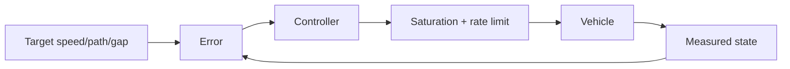
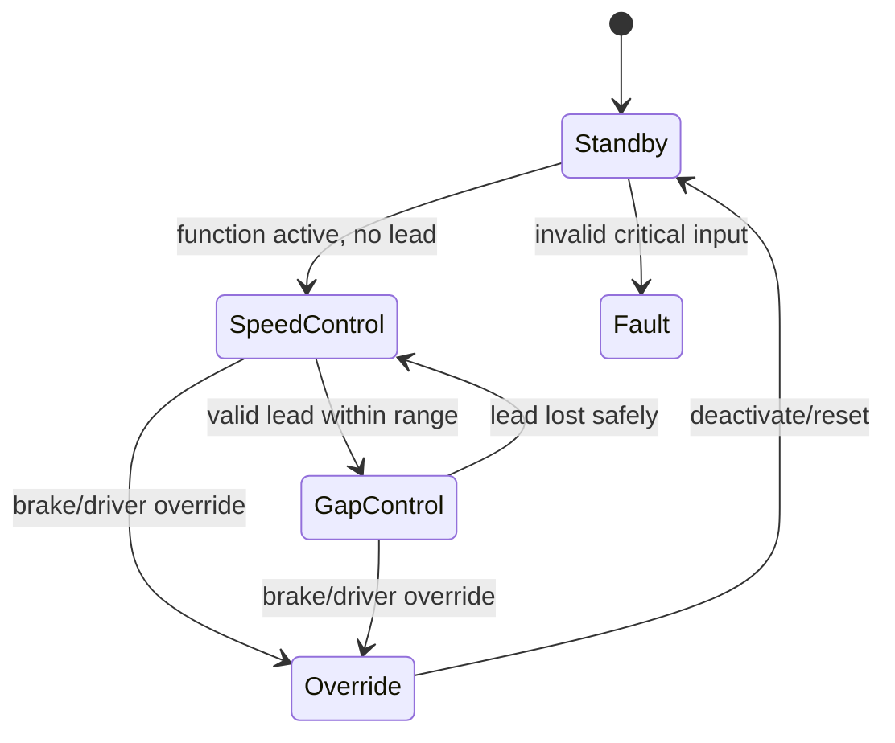
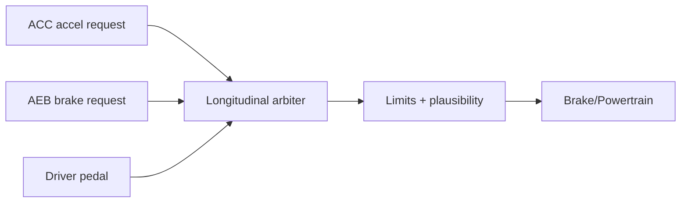

# Longitudinal và lateral motion control

## Closed loop



Controller không gửi “mong muốn” vô hạn. Output phải qua physical limit, rate/jerk limit, arbitration và safety monitoring.

## PID

```text
u = Kp·e + Ki·∫e dt + Kd·de/dt
```

- P phản ứng error hiện tại;
- I xóa steady-state error nhưng có windup;
- D dự đoán trend nhưng nhạy noise;
- saturation cần anti-windup;
- derivative thường filter hoặc lấy trên measurement.

ACC-like longitudinal control có hai mục tiêu: speed control khi không có lead vehicle và gap control khi có lead. Time-gap target điển hình ở dạng `desired_gap = standstill_gap + time_headway·ego_speed`.



## Lateral control

Lane centering dùng path/curvature, lateral error, heading error, yaw rate và speed. Controller demo kết hợp heading correction với cross-track correction kiểu Stanley-like, rồi clamp steering.

Tốc độ càng cao, cùng steering angle tạo yaw response lớn; gain scheduling theo speed thường cần thiết. Steering actuator delay/rate limit và road curvature feed-forward ảnh hưởng tracking.

## Arbitration

AEB, ACC, LKA, driver input và stability control có thể cùng yêu cầu motion. Function software thường tạo request + priority/validity, không trực tiếp điều khiển actuator tùy architecture.



## Calibration

Gain, threshold, time-gap và limit thường calibration được. Calibration cần range/default/version, measurement/XCP workflow và regression across variants. Không hard-code mọi threshold trong algorithm.

## Middle-level expectations

Giải thích được stability/overshoot/settling, saturation/windup, noise/filter/delay, discretization, state transition, degraded/override và cách thiết kế scenario để tune/verify—not cần trở thành control-theory researcher.
