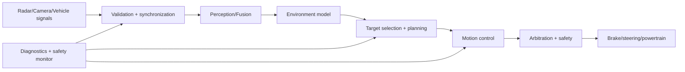

# ADAS functions, sensors và architecture

## Function map

| Function | Main input | Main output/control |
|---|---|---|
| ACC | lead object, ego speed | target acceleration/time gap |
| AEB | collision threat | emergency brake request |
| FCW | threat + driver state | warning |
| LKA/LCA | lanes/path, ego motion | steering request |
| TJA | lead/lane at low speed | combined longitudinal/lateral |
| BSD/LCA | side/rear objects | warning/lane-change inhibition |

## End-to-end architecture



Current final project covers validation, simplified fusion, TTC decision and new motion simulation. It does not implement ML perception or production actuator control.

## Sensor characteristics

Radar: range/relative velocity robust in weather, angular resolution/ghost/multipath concerns. Camera: semantic/lane rich, affected by lighting/weather/calibration. Ultrasonic: near field/parking. Lidar: accurate geometry, cost/weather/data volume trade-offs. IMU/wheel speed/steering angle support ego motion.

## Data quality

Every signal needs value plus timestamp, validity, quality/confidence and source. Timeout, frozen data, out-of-sequence, counter/CRC and coordinate calibration are different failures.

## Network

CAN/FlexRay/Ethernet transport has different bandwidth/timing. SOME/IP/DDS/service IPC may appear on HPC; AUTOSAR COM/PduR/CanIf on Classic. XCP supports measurement/calibration; diagnostics uses UDS. Architecture must define latency budget from sensing to actuation.

## Real-time budget

```text
sensor acquisition + transport + synchronization + algorithm + scheduling
+ output transport + actuator response <= feature latency requirement
```

Average latency is insufficient; analyze worst-case/jitter/overload and stale-data rejection.
