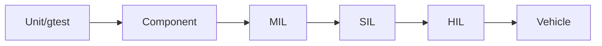

# Verification: unit, MIL, SIL và HIL

## Test ladder

- Unit: function/class isolation, boundary/error/transition.
- MIL: control/plant model, nhanh cho algorithm/tuning.
- SIL: compiled software chạy với simulation, kiểm tra integration/numerics.
- HIL: ECU thật + real-time plant/bus/I/O, kiểm tra timing/hardware integration.
- Vehicle: validate intended behavior thực tế.

## Scenario-based testing

Scenario có initial conditions, actors, road/weather, actions, expected KPI và pass/fail. Ví dụ ACC cut-in: ego 80 km/h, target lane object cut-in, gap/speed profile; KPI min TTC, peak decel, jerk, settling và no false deactivation.

## gTest competence

Biết fixture, parameterized/typed test, mock/fake, death test khi phù hợp, matcher, test naming và isolation. Quan trọng hơn framework là test design: equivalence partition, boundary, decision table, state transition, fault injection và requirement trace.

## Defect analysis

Reproduce → minimize → collect timeline/log/signal → locate last correct boundary → hypothesis/falsification → root cause → fix → regression. Với control issue, plot input/state/output trên cùng time axis; không chỉ đọc log text.

## SIL/HIL gap

SIL không chứng minh ECU I/O/real-time/hardware. HIL không chứng minh toàn bộ real-world scenario/perception. Mỗi level có mục tiêu riêng; “test pass” chỉ có nghĩa trong scope/environment xác định.

## Tool exercises

Python/Matplotlib đọc CSV simulation, tính KPI và plot. MATLAB/Simulink dùng plant/control model nếu JD cần. CANoe/CAPL cho network simulation, XCP calibration/measurement, CarMaker/CARLA cho vehicle/scenario tùy role.
