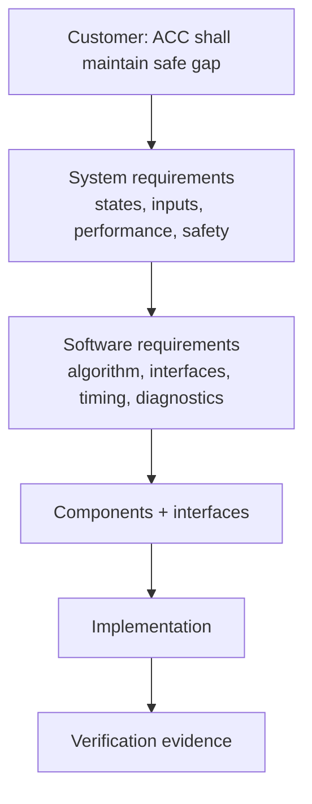

# Requirements, ASPICE, Functional Safety và SOTIF

## Requirement breakdown

Requirement tốt phải singular, unambiguous, verifiable, feasible, traceable và có units/tolerance/conditions. “System shall respond quickly” không test được; cần deadline và measurement point.

## ASPICE view

Middle developer cần làm được SWE.1 requirement analysis, SWE.2 architecture, SWE.3 detailed design/unit construction, SWE.4 unit verification, SWE.5 integration test và SWE.6 qualification test trong phạm vi work product; hiểu SYS.2/SYS.3 upstream và change/config/problem management support processes.

## ISO 26262

Safety lifecycle đi từ hazard/risk → safety goal → functional/technical/software safety requirements → architecture/mechanism → verification. Developer không tự gán ASIL cho function. Freedom from interference, timing/memory protection, plausibility, watchdog, safe state và diagnostic coverage phải trace về safety requirement.

## SOTIF

ISO 21448 xử lý hazard do functional insufficiency hoặc foreseeable misuse dù không có hardware/software fault—ví dụ camera không nhận đúng vật thể trong điều kiện giới hạn. Dataset/scenario coverage, known/unknown unsafe scenarios và perception limitation quan trọng.

## Estimation và risk

Break task theo requirement/design/code/unit/integration/review/documentation. Nêu assumption, dependency, unknown, confidence và contingency. Risk record gồm probability, impact, mitigation, owner, due date và trigger.

## Review evidence

Design review cần alternative/trade-off, interface, state/ownership/timing, failure behavior, testability và open risks. Code review không chỉ format; kiểm tra requirement, numerical range, concurrency, calibration, observability và regression tests.
