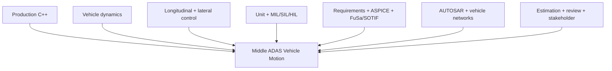

# Middle ADAS Vehicle Motion Engineer Track

Chương trình mục tiêu: sau khi hoàn thành và tự bảo vệ capstone, ứng viên có thể nhắm tới role **ADAS Vehicle Motion / Function Software Engineer** ở mức junior mạnh đến middle tùy kinh nghiệm delivery thực tế.

## Năng lực đích

## Tài liệu

1. [JD market skill matrix](01_jd_market_skill_matrix.md)
2. [Vehicle dynamics từ căn bản](02_vehicle_dynamics.md)
3. [Longitudinal và lateral control](03_motion_control.md)
4. [ADAS functions, sensors và architecture](04_adas_functions_architecture.md)
5. [MIL/SIL/HIL, gTest và defect analysis](05_verification_validation.md)
6. [ASPICE, ISO 26262, SOTIF và requirements](06_process_safety.md)
7. [24-week professional curriculum](07_curriculum_24_weeks.md)
8. [Middle readiness rubric](08_middle_readiness_rubric.md)

## Capstone mới

Final project được mở rộng bằng kinematic bicycle model, longitudinal ACC-like PID, lateral lane-centering controller và scenario simulation. Mục đích là nối software architecture với vehicle physics và verification—not tạo AEB/ACC production.
