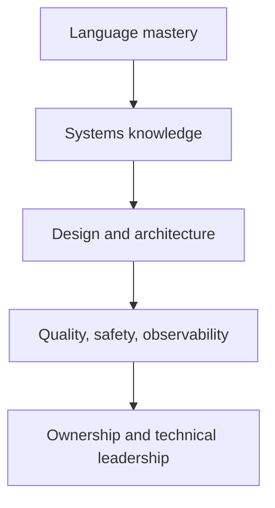

# Senior roadmap và tiêu chí đầu ra

Senior không phải người nhớ nhiều syntax nhất. Senior có thể biến requirement mơ hồ thành design có trade-off, tìm failure mode, hướng dẫn team, đo performance, review ownership/concurrency và chịu trách nhiệm cho production issue.

## Ma trận năng lực

| Mảng | Mid-level | Senior-level evidence |
|---|---|---|
| C/C++ | code đúng happy path | hiểu lifetime, UB, ABI, allocation, exception/concurrency policy |
| Build | chạy được build | trace compile/link, đọc ELF/map, tối ưu incremental/reproducible build |
| Design | áp dụng pattern | chọn/không chọn pattern dựa coupling, timing, ownership |
| Concurrency | dùng mutex | chứng minh invariant, lock order, shutdown, overload và memory visibility |
| Linux | gọi API | thiết kế daemon/event loop/IPC, xử lý partial I/O, signal, restart |
| Embedded | dùng driver | trace requirement → MCAL → register → waveform, phân tích WCET/memory |
| Quality | viết unit test | xây test strategy, observability, fault injection và regression |
| Leadership | hoàn thành task | breakdown, risk/dependency, review, mentor và incident ownership |

## Portfolio bắt buộc

1. Static embedded gateway bằng C: no heap, generated-like config, tests, map file.
2. Container library: vector/ring/hash với allocator/error strategy rõ.
3. Multithreaded pipeline C++: bounded queue, cancellation, metrics và race tests.
4. Linux daemon: Unix socket + shared memory hoặc TCP, epoll, graceful shutdown.
5. ADAS mini-platform: frame pool, timestamps, fusion stub, degraded mode.

Mỗi project phải có architecture diagram, API contract, ownership table, concurrency model, failure modes, benchmark, tests và retrospective.
